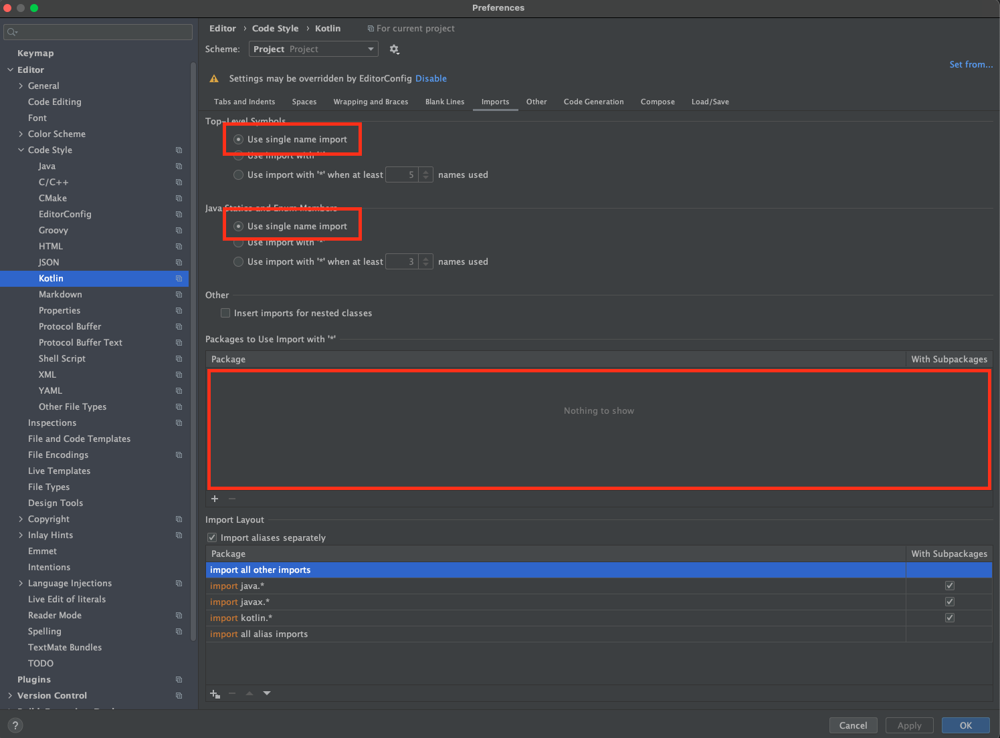

# 표준 개발 가이드 [ROOT](/readme.md)

<!-- TOC -->

* [표준 개발 가이드 ROOT](#표준-개발-가이드-root)
* [설정](#설정)
* [git](#git)
* [PR](#pr)
* [Domain](#domain)
    * [Domain Naming Rule](#domain-naming-rule)
        * [prefix rule](#prefix-rule)
        * [suffix rule](#suffix-rule)
* [기술](#기술)
    * [기본](#기본)
    * [사용금지 기술](#사용금지-기술)
    * [사용권장기술](#사용권장기술)
* [1. Architecture](#1-architecture)
    * [Clean Architecture](#clean-architecture)
        * [Directory Structure](#directory-structure)
        * [Naming Rule](#naming-rule)
        * [역할](#역할)
    * [data layer](#data-layer)
        * [api 호출 결정 지도](#api-호출-결정-지도)
        * [kotlin serialization 사용 시 설정](#kotlin-serialization-사용-시-설정)
        * [data source 샘플코드](#data-source-샘플코드)
        * [repository 샘플코드](#repository-샘플코드)
    * [domain layer](#domain-layer)
        * [entity 샘플코드](#entity-샘플코드)
        * [usecase 샘플코드](#usecase-샘플코드)
    * [presentation layer](#presentation-layer)
        * [MVVM Pattern 을 이용해서 구성합니다.](#mvvm-pattern-을-이용해서-구성합니다)
        * [ViewModel 샘플코드](#viewmodel-샘플코드)
        * [Ui 샘플코드](#ui-샘플코드)

<!-- TOC -->

# 설정

1. android studio 설치 후 설정
    1.  
2. clone 후에 할일
    1. [commit-msg_install.sh](../setting/commit-msg_install.sh)
        1. commit message 를 자동으로 입력해주는 스크립트
    2. [pre-push_install.sh](../setting/pre-push_install.sh)
        1. pr 을 자동으로 만들어 주는 스크립트
        2. push 후에 브라우저 주소 창에 붙여 넣기 하면 자동으로 pr 내용을 채워 준다

# git

1. git Convention
    1. branch 이름을 만들어 주는 shell script
        1. [branch_name_creator.sh.command](../shell/branch_name_creator.sh.command)
    2. feature/[JIRA 이슈번호]-기능이름
        1. feature/TICKET-1234-TEST-기능-만들기
    3. pr message : [JIRA 이슈번호]-기능이름
        1. [TICKET-1234] TEST-기능-만들기

# PR

1. pr template
    1. [PULL_REQUEST_TEMPLATE.md](../../.github/PULL_REQUEST_TEMPLATE.md)

# Domain

1. 섹션
2. 카페
3. 이웃
4. 체팅
5. 글상세
6. 글쓰기

## Domain Naming Rule

### prefix rule

- Domain Naming 은 이름작성시 prefix로 붙여서 작성합니다.

| Domain  | 한글이름 |
|---------|------|
| section | 섹션   |
| cafe    | 카페   |
| local   | 이웃   |
| chat    | 체팅   |
| read    | 글상세  |
| edit    | 글쓰기  |

### suffix rule

- 첫화면을 Home으로 표기합니다.

| name | 용도  |
|------|-----|
| home | 첫화면 |

- 예 SectionHome : 섹션 첫화면

# 기술

## 기본

1. kotlin
2. clean architecture
3. mvvm
4. retrofit
5. kotlin dsl
6. glide
7. hilt

## 사용금지 기술

1. rx
2. parcelable
3. databinding
4. png
5. xml

## 사용권장기술

1. coroutine
2. flow
3. mvi
4. udf
5. compose
6. kotlin serialization
7. unit test
8. coil

# 1. Architecture

## Clean Architecture

### Directory Structure

```

data
    di
    model
    repository
    source

domain
    entity
    repository
    usecase

persenter
    compose
    model
    ui

```

### Naming Rule

| layer     | folder     | DomainName~~~~Tail                               |
|-----------|------------|--------------------------------------------------|
| data      |            |                                                  |
|           | di         | ~~~Module.kt                                     |
|           | model      | ~~~ApiModel.kt<br/>~~~RoomModel.kt               |
|           | repository | ~~~RepositoryImpl.kt                             |
|           | source     | ~~~LocalDataSource.kt<br/>~~~RemoteDataSource.kt |
| domain    |            |                                                  |
|           | entity     | ~~~Entity.kt                                     |
|           | repository | ~~~Repository.kt                                 |
|           | usecase    | ~~~UseCase.kt                                    |
| presenter |            |                                                  |
|           | compose    | @Composable ~~~ View.kt                          |
|           | model      | ~~~ UiModel.kt                                   |
|           | ui         | ~~~Activity.kt, ~~~ViewModel.kt, ~~~Screen.kt    |

### 역할

| layer     | folder     | 역할                                               |
|-----------|------------|--------------------------------------------------|
| data      |            |                                                  |
|           | di         | data layer 에서 사용하는 주입 연결                         |
|           | model      | data layer 에서 사용 data class                      |
|           | repository | 여러 출처에서 만들어진 data를 domain entity로 변경해서 전달 하는 구현체 |
|           | source     | data source pref,서버,db, 센서, gps                  |
| domain    |            |                                                  |
|           | entity     | 최상위 data model                                   |
|           | repository | data layer의 interface                            |
|           | usecase    | entity를 전달 받을수있는 구현체                             |
| presenter |            |                                                  |
|           | compose    | 컴포넌트 Composable, 지역적 Composable                  |
|           | ui         | ViewModel과 ViewModel을 직접사용하는 screen              |
|           | model      | ui에서 사용하는 model                                  |

## data layer

### kotlin serialization 사용 시 설정

 
 

- data 관리 계층


```kotlin
interface MainRemoteDataSource {
    @GET("main/list")
    fun getMainList(): Flow<List<MainApiModel>>
}

@Dao
interface MainLocalDataSource {

    @Query("SELECT * FROM main_data")
    fun getMainList(): Flow<List<MainRoomModel>>

    @Insert(onConflict = OnConflictStrategy.REPLACE)
    suspend fun insertMainList(mainList: List<MainData>)
}

```

### repository 샘플코드

```kotlin
class MainRepositoryImpl(
    private val remoteDataSource: MainRemoteDataSource,
    private val localDataSource: MainLocalDataSource
) : MainRepository {

    override fun getMainList(): Flow<MainListState> {
        return flow {
            val cache = localDataSource.getMainList().firstOrNull()
            if (cache != null) {
                emit(MainListState.Success(cache.toEntity()))
            }
            remoteDataSource.getMainList()
                .map { response ->
                    val data = response.map { it.toMainData() }
                    localDataSource.insertMainList(data)
                    MainListState.Success(data)
                }
                .onStart { emit(MainListState.Loading) }
                .catch { e ->
                    emit(MainListState.Error(e.message ?: "An error occurred!"))
                }
                .collect { response ->
                    emit(response)
                }
        }
    }
}

```

## domain layer

- data layer과 presentation layer를 계층

### entity 샘플코드

```kotlin
data class MainEntity {
    val id: Long,
    val title: String,
    val content: String,
    val imageUrl: String
}
```

### usecase 샘플코드

```kotlin
```

## presentation layer

- 사용자와 직접인 연동을 하는 계층

### MVVM Pattern 을 이용해서 구성합니다.

- UI는 compose를 이용해서 구현 합니다.
- ViewModel은 View의 상태를 관리 합니다.
- ViewModel은 UseCase를 이용해서 Domain Layer의 데이터를 수집,변경,삭제,추가,검색,정렬합니다.
- ViewModel은 View의 상태를 변경합니다.
    - ViewModel에서는 상태만 다루고 직접적인 값은 다루지 않습니다. 따라서 context를 사용하지 않습니다.

### ViewModel 샘플코드

- ViewModel에서 View에 전달할 상태는 StateFlow를 이용해서 전달 합니다.

```kotlin
class MainViewModel(
    private val getMainListUseCase: GetMainListUseCase
) : ViewModel() {

    private val _mainListStateFlow = MutableStateFlow<MainListState>(MainListState.UnInitialized)
    val mainListStateFlow: StateFlow<MainListState> = _mainListStateFlow

    init {
        viewModelScope.launch {
            getMainListUseCase()
                .collect {
                    _mainListStateFlow.value = it
                }
        }
    }
}
```

- ViewModel에서 View에 상태를 전달할때는 sealed class를 이용해서 전달 합니다. 다음은 예제입니다.

```kotlin
sealed class MainListState {
    object UnInitialized : MainListState()

    object Loading : MainListState()

    data class Success(
        val mainList: List<MainModel>
    ) : MainListState()

    object Error : MainListState()
}
```

- 위 둘을 묶어서 사용하면 아래와 같습니다.

```kotlin
sealed class TaskListState {
    object Loading : TaskListState()
    data class Success(val taskList: List<Task>) : TaskListState()
    object Error : TaskListState()
}

class TaskListViewModel(private val getTaskListUseCase: GetTaskListUseCase) : ViewModel() {
    private val _taskListStateFlow = MutableStateFlow<TaskListState>(TaskListState.Loading)
    val taskListStateFlow: StateFlow<TaskListState> = _taskListStateFlow

    init {
        viewModelScope.launch {
            getTaskListUseCase()
                .catch {
                    _taskListStateFlow.value = TaskListState.Error
                }
                .collect {
                    _taskListStateFlow.value = TaskListState.Success(it)
                }
        }
    }
}
```

### Ui 샘플코드

- View는 ViewModel의 StateFlow를 Observe 합니다.

```kotlin
@Composable
fun TaskListScreen(viewModel: TaskListViewModel) {
    val taskListState by viewModel.taskListStateFlow.collectAsState()

    when (taskListState) {
        TaskListState.Loading -> {
            // 로딩중 처리
            TaskLoadingView(taskListState)
        }
        is TaskListState.Success -> {
            // 성공 처리
            TaskSuccessView(taskListState)
        }
        TaskListState.Error -> {
            // 오류 처리
            TaskErrorView(taskListState)
        }
    }
}

@Composable
fun TaskSuccessView(taskListState: TaskListState.Success) {
    val taskList = taskListState.taskList
    // UI 구현
}
```


